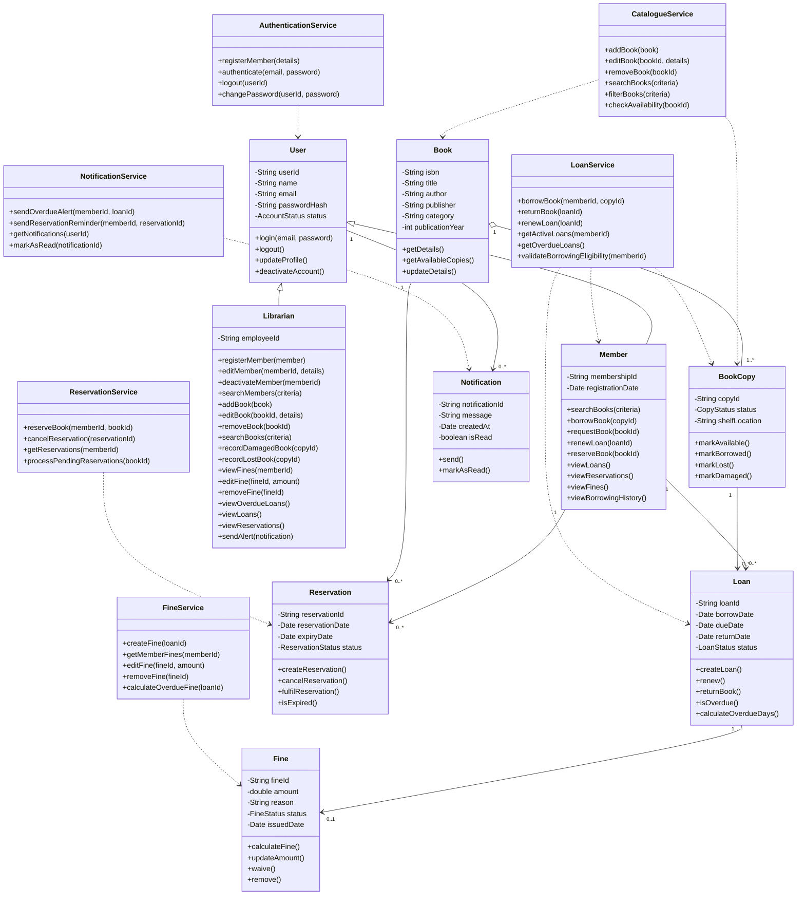

### Features:
#### Librarian features
- Log in through the shared authentication system.
- Register, edit, deactivate, and search members.
- Add, edit, remove, and search books.
- Record damaged or lost books.
- View, edit and remove fines for members.
- View overdue, loan and reservation.
- Send in-app alerts for overdue loans and reminder for pending reservations.
#### Member features
- Register and log in.
- Search and filter the book catalogue.
- View book availability and details.
- Borrow or request available books.
- Renew active loans when permitted.
- Reserve unavailable books.
- View current loans, due dates, reservations, fines, and borrowing history.
- Receive in-app overdue and reservation notifications.

### Possible Architecture
#### Project structure
src/
├── models/
│   ├── User
│   ├── Member
│   ├── Librarian
│   ├── Book
│   ├── BookCopy
│   ├── Loan
│   ├── Reservation
│   ├── Fine
│   └── Notification
│
├── services/
│   ├── AuthenticationService
│   ├── CatalogueService
│   ├── LoanService
│   ├── ReservationService
│   ├── FineService
│   └── NotificationService
│
├── member/
│   ├── MemberController
│   └── MemberView
│
└── librarian/
    ├── LibrarianController
    └── LibrarianView

#### Class Diagram - just for reference, list out so later easier do integration

### Work split

| Shared class/service | Primary owner |
|---|---|
| `User`, `Member`, authentication | Member-role developer |
| `Book`, `BookCopy`, catalogue search | Member-role developer |
| `Loan`, borrowing rules | Member-role developer |
| `Reservation` | Member-role developer |
| `Librarian` | Librarian-role developer |
| Fine-related logic | Librarian-role developer |
| Notification logic | Librarian-role developer |
| Integration| Both |
