# LibConnect User Guide

LibConnect is a Java desktop application for library catalogue, book-copy, loan,
reservation, fine, and notification management. Members use it to find and
borrow books, manage loans and reservations, pay fines, and read notifications.
Librarians use it to maintain members, catalogue books, physical copies,
reservations, fines, loans, and alerts.

#### Contents
- [Quick Start](#quick-start)
- [Account Creation and Login](#account-creation-and-login)
- [Member Guide](#member-guide)
- [Librarian Guide](#librarian-guide)

## Quick Start

### Requirements

- Java Development Kit (JDK) 25.
- Maven 3.9 or later when running from the project checkout.
- A desktop display supported by JavaFX. JavaFX UI tests and the application do
  not run correctly in a display-less shell.

The release JAR contains the application dependencies, but it still needs a JDK
25 runtime and a writable working directory containing the `data/` directory.

Check the tools before starting:

```text
java --version
mvn --version
```

Both commands must report Java 25. If Maven reports an older Java version, select
JDK 25 as `JAVA_HOME` before running Maven.

### Start from the project checkout

From the repository root, run:

```text
mvn exec:java
```

The LibConnect login window opens. All library actions are performed in the
desktop window; LibConnect has no command-line command language.

### Start the release JAR

Build the release artifact from the repository root:

```text
mvn -Prelease clean package
```

The executable JAR is created at `target/libconnect-1.0.0.jar` and copied to
`release/libconnect-1.0.0.jar`. Run it from a directory that contains the
application's writable `data/` directory:

```text
java -jar target/libconnect-1.0.0.jar
```

The JavaFX native libraries in a release are platform-specific. Build the JAR on
the operating system and architecture where it will be used.

### Set up a repeatable manual test

The checked-in data files may contain no books, copies, members, loans,
reservations, fines, or notifications. For a clean manual test, make a backup of
`data/` first, then:

1. Run LibConnect.
2. Select `Create account`.
3. Register one `Librarian` account with an employee ID.
4. Register one `Member` account with a different email address.
5. Log in as the librarian and add a book in `Books`.
6. Add an available copy for that book in `BookCopy`.
7. Log out with `Log out` and log in as the member.
8. Use the member workflows below to search for the book, borrow the copy, and
   inspect loans, fines, reservations, and notifications.

Use a copy of the data directory for peer testing if you need to repeat the
workflow without retaining previous test records.

## Account Creation and Login

### Register an account

1. From the login page, select `Create account`.
   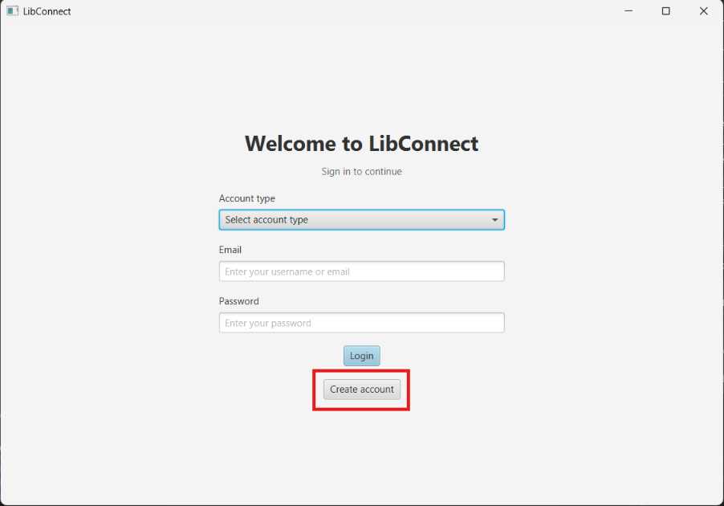

1. Select `Member` or `Librarian` in `Account type`.
   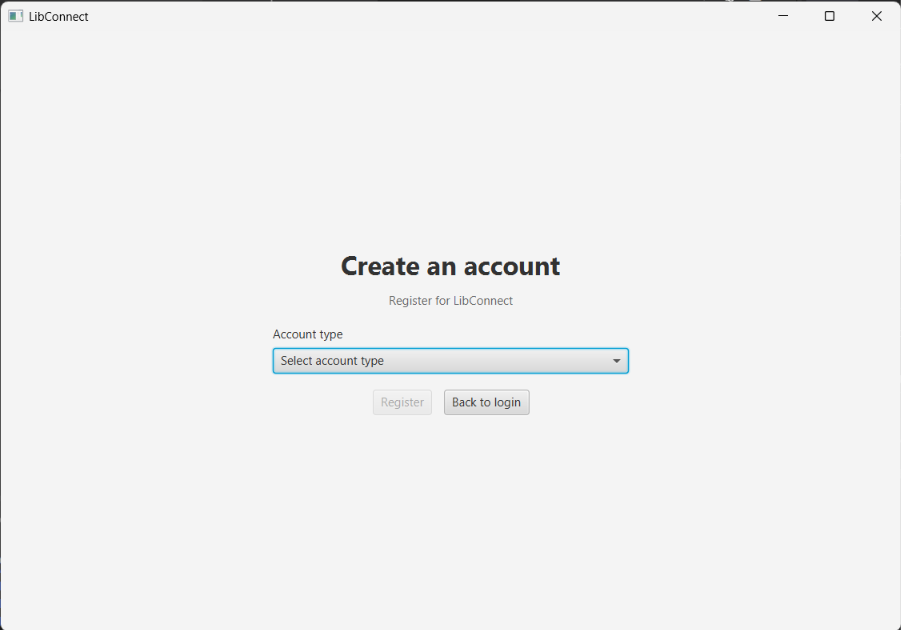
1. Enter `Name`, `Email`, `Password`, and `Confirm password`.
   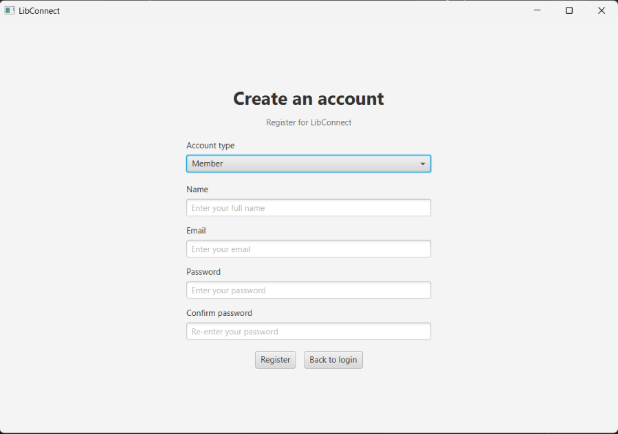
1. If `Librarian` is selected, provide the `Employee ID` as well.
1. Select `Register`.
1. Return to the login page and sign in.

The two password fields must match. Blank required fields show `Name, email and
password are required.`, and mismatched passwords show `Passwords do not match.`
Librarian registration without an employee ID shows `Employee ID is required for
librarian accounts.` A successful registration shows `Account created
successfully. Please log in.`

### Logging in

1. Select `Member` or `Librarian` in the login page's account-type selector.
   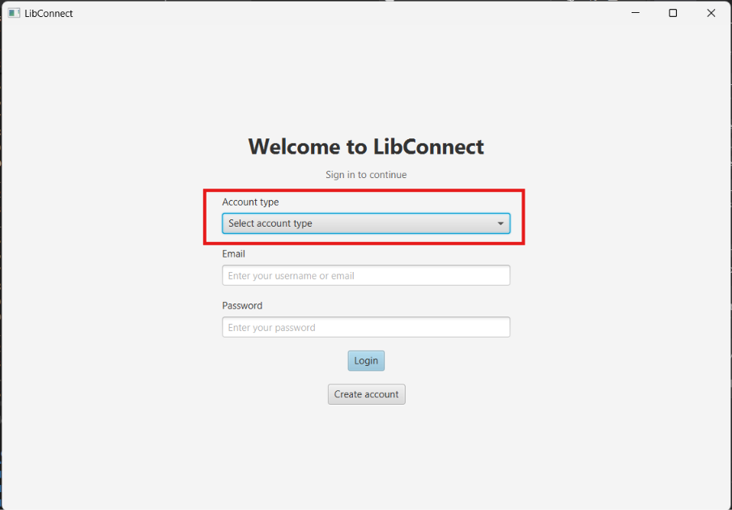
2. Enter the account email in the `Email` field.
3. Enter the password in the `Password` field.
4. Select `Login`.
5. Select `Logout` in the member navigation bar or `Log out` in the librarian
   workspace when finished.

Successful member login opens `Dashboard`. 
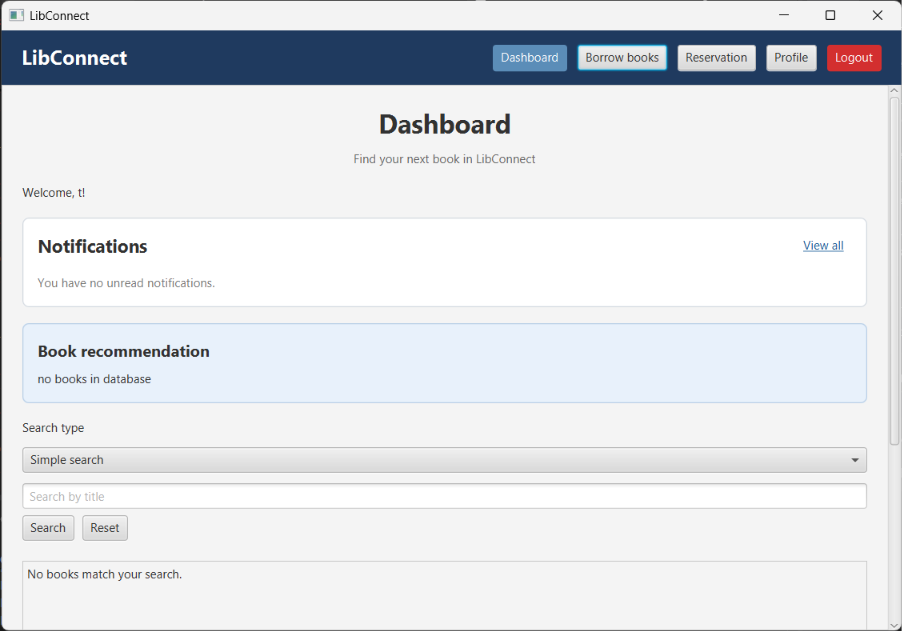

Successful librarian login opens the `LibConnect Librarian` workspace. 
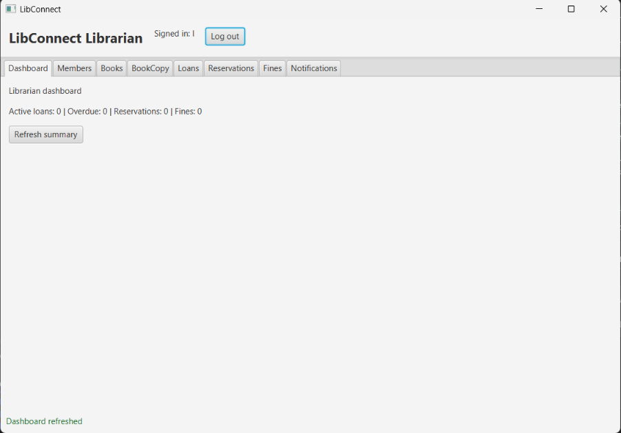

Invalid credentials show `Invalid email or password.` A deactivated account shows `This account is deactivated and cannot log in.`

## Member Guide

After logging in, members can access four pages from the navigation bar: **Dashboard**, **Borrow books**, **Reservation**, and **Profile**. The navigation bar also includes a **Logout** button.

Members can view their loans and fines, and update their name, email address, or password on the **Profile** page.

#### Contents
- [View Notifications](#view-notifications)
- [Random Book Recommendation](#random-book-recommendation)
- [Searching the Book Catalogue](#searching-the-book-catalogue)
- [Borrowing Books](#borrowing-books)
- [Creating a Reservation](#creating-a-reservation)
- [Update User Profile and Password](#update-user-profile-and-password)
- [View, Renew and Return Loans](#view-renew-and-return-loans)
- [View and Pay Fines](#view-and-pay-fines)

### View Notifications

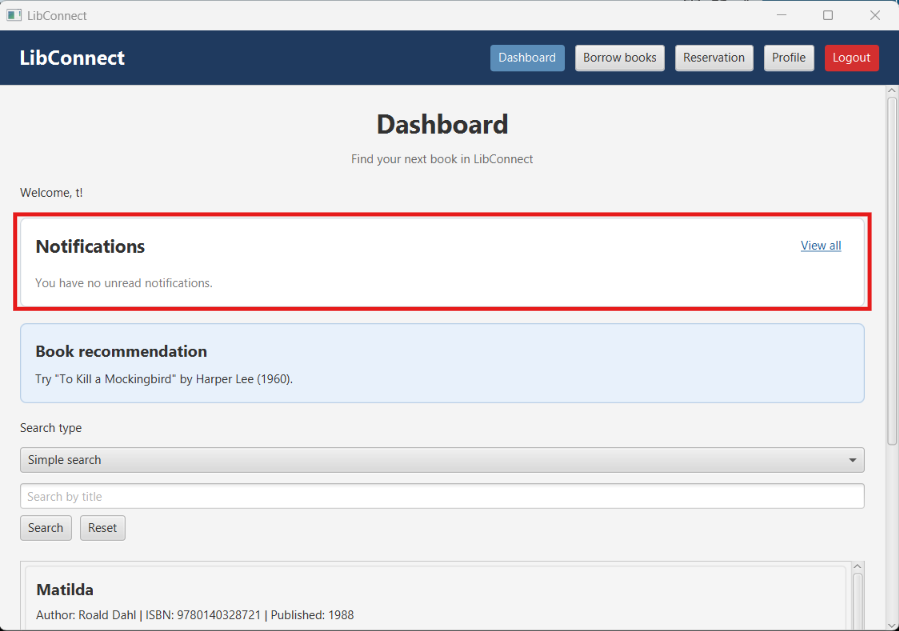

Members can view unread notifications in the notification bar on the dashboard. Click a notification to read its full details. To view all notifications, including those already read, click **View All**.

### Random Book Recommendation

LibConnect will provide a random recommendation for a book for members to try to read. 

### Searching the Book Catalogue

Members can search for a book in the available catalog using the search function on the `Dashboard` page. Members can click on a book to view more information about the book, as well as the number of copies available, and the shelf locations.

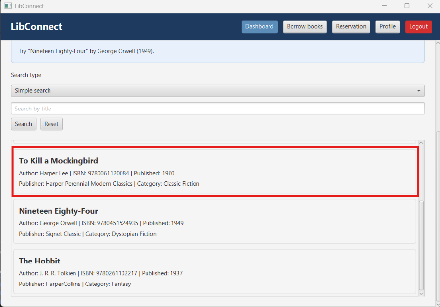

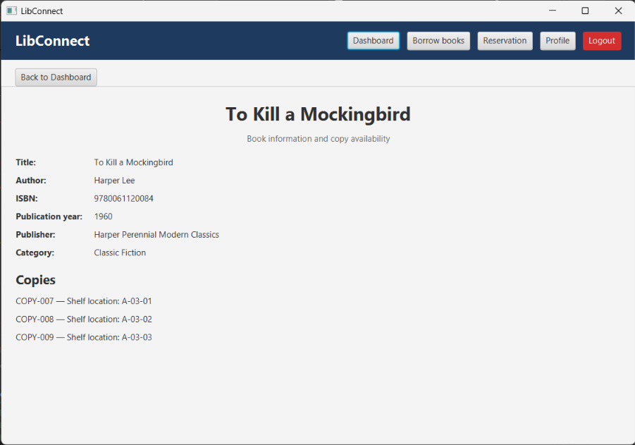

LibConnect supports 2 types of searches, Simple and Advanced.

#### Simple Search

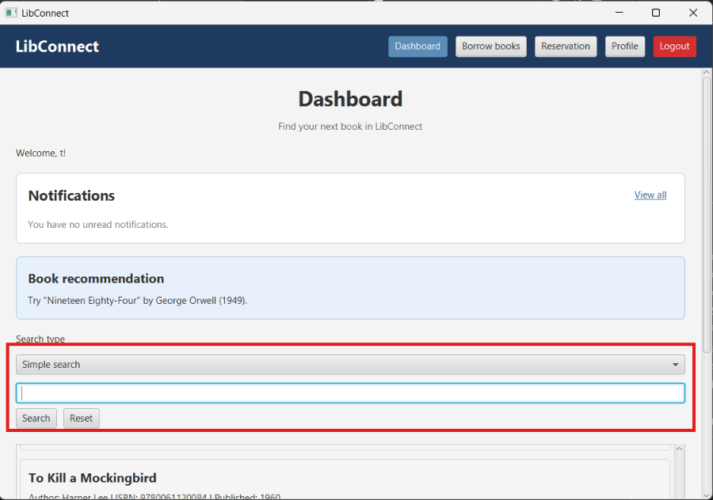

Simple search is case-insensitive and returns books whose titles contain the keyword or phrase you enter. It supports partial matches. For example, searching for `cook` returns titles such as `COOK`, `cook`, and `cookbook`.

To view all books in the catalog, leave the search field blank and click **Search**, or click **Reset**.

#### Advanced Search

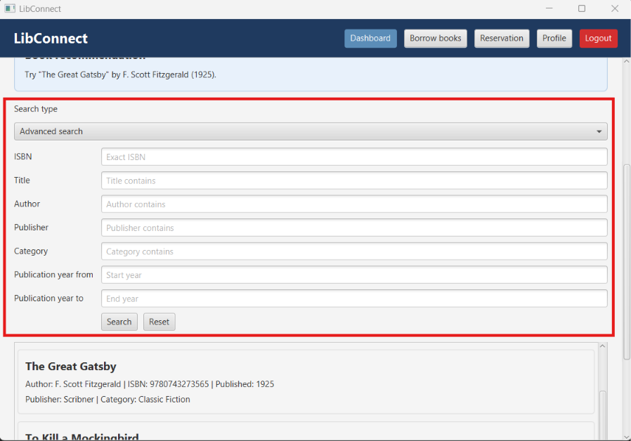

Advanced search lets you filter books by additional details, such as author, ISBN, and publication year. Leave a field blank to exclude it from the search.

Like simple search, text searches are case-insensitive and match partial text. ISBN and publication year searches are exceptions: enter the exact ISBN to search by ISBN.

For publication year, you can enter a start year, an end year, or both:

- **Start year only:** Finds books published in that year or later. For example, `2008` finds books published in 2008 and later.
- **End year only:** Finds books published in that year or earlier. For example, `2020` finds books published in 2020 and earlier.
- **Both years:** Finds books published between the start and end years, inclusive.

Similarly, to view all books in the catalog, leave the search field blank and click **Search**, or click **Reset**.

### Borrowing Books

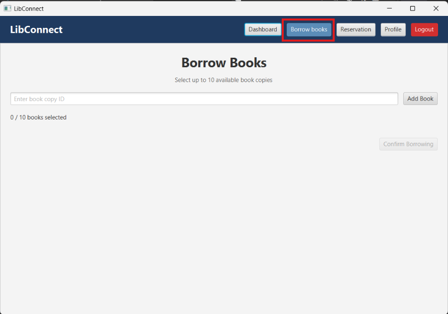

Members can borrow books from the **Borrow books** page.

Enter the **Copy ID** of a book and click **Add book** to add it to the transaction. You can add up to 10 books per transaction. To remove a book from the list, click **Remove** beside it.

After adding all the books you want to borrow, click **Confirm Borrowing**. LibConnect will create a loan for each selected book.

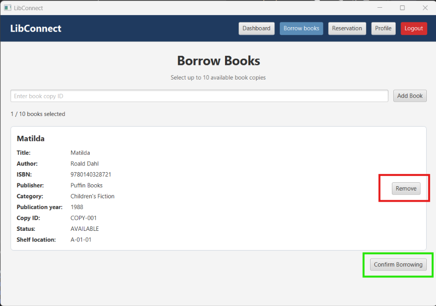

> [!NOTE]
> Books marked as `BORROWED`, `DAMAGED`, or `LOST` cannot be borrowed. LibConnect will reject attempts to borrow these books.

### Creating a Reservation

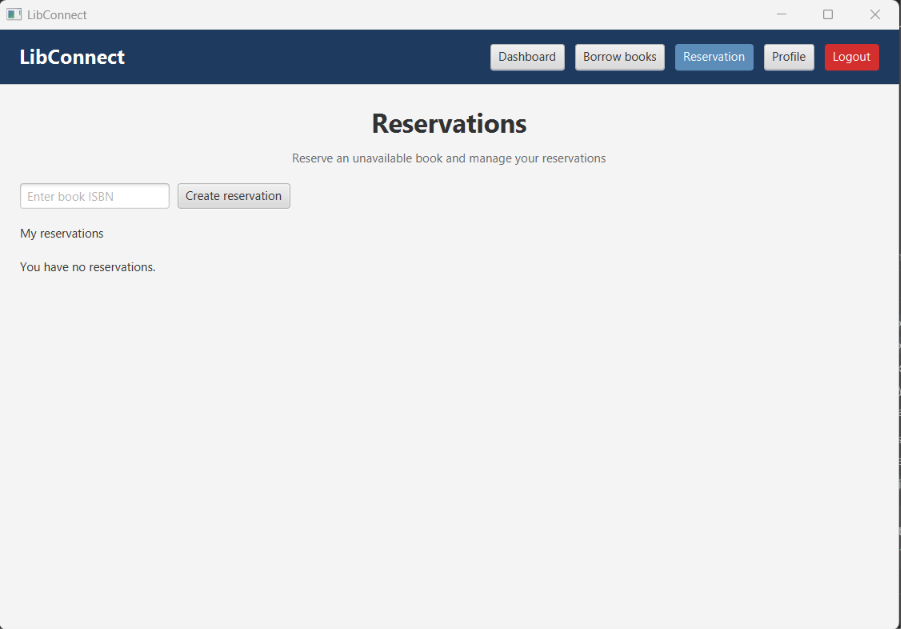

If all copies of a book are unavailable, members can reserve it from the **Reservation** page. Enter the book’s ISBN and click **Create Reservation**.

When a copy becomes available, LibConnect will notify the member to collect it. Members can cancel their reservation at any time before it is fulfilled. Once they have received the book, it can no longer be cancelled.

> [!NOTE]
> Members will not be allowed to make a reservation for a book if there are copies available currently.

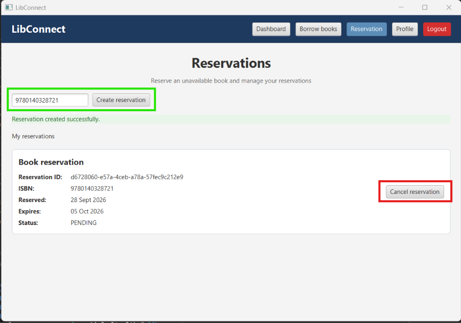

The default reservation period is seven days. LibConnect displays an error message if the book is unknown or if the member has a duplicate pending reservation, or the member is inactive or unknown.

### Update User Profile and Password 

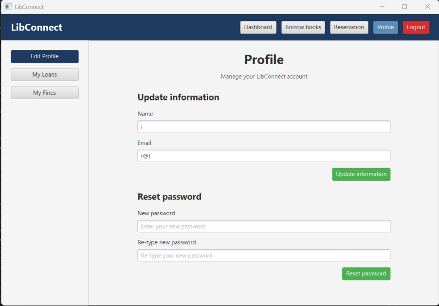

Members can update their name, email address, or password on the **Profile** page. LibConnect displays a success message when an update is complete or an error message if it fails.

When changing a password, enter the same password in both fields. If the passwords do not match, LibConnect displays an error message. Members cannot change their email address to one that is already in use; LibConnect displays an error message if they try.

### View, Renew, and Return Loans

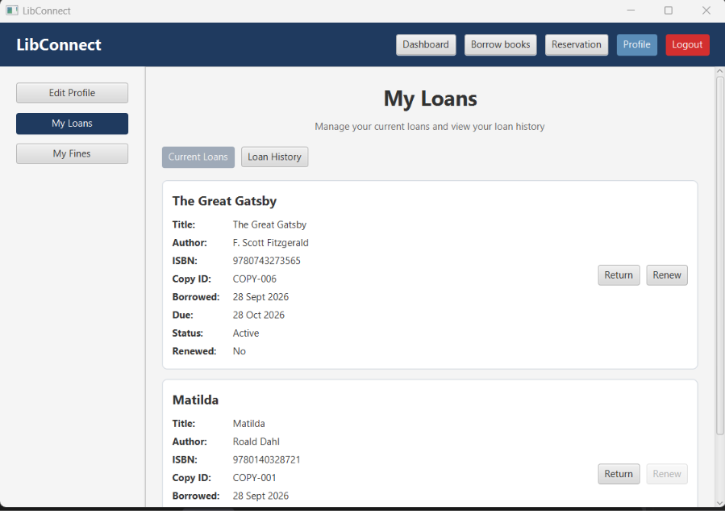

Members can view their loans on the **My Loans** subpage of the **Profile** page. Select **Current Loans** to view active loans. From there, members can renew or return a loan. To view past loans, select **Loan History**.

> [!NOTE]
> All loans can only be renewed a maximum of one time.

> [!NOTE]
> Overdue loans cannot be renewed. When an overdue loan is returned, LibConnect automatically calculates and creates an outstanding fine for the member.

### View and Pay Fines

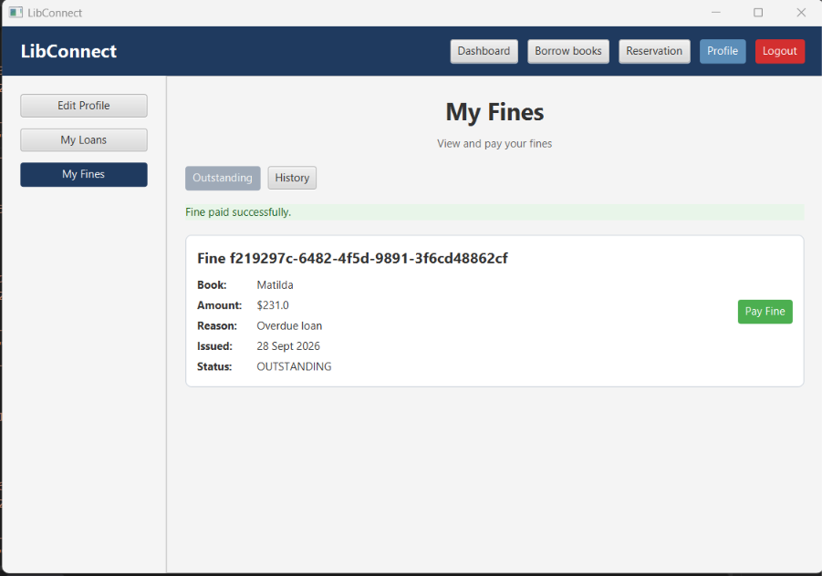

Members can view their fines on the **My Fines** subpage of the **Profile** page. Select **Outstanding** to view unpaid fines. Click **Pay Fine** to pay a fine. To view paid fines, select **History**.

> [!NOTE]
> A member can only pay a fine issued to their account. Currently, LibConnect does not support payment of fines for another member's account.

## Librarian guide

Log in with account type `Librarian` to open `LibConnect Librarian`. The workspace
contains these tabs in the current release:

| Tab | Available actions |
| --- | --- |
| `Dashboard` | Refresh counts for active loans, overdue loans, reservations, and fines. |
| `Members` | Search, register, edit, reset a member password, deactivate, and activate members. |
| `Books` | Search, add, edit, and remove catalogue books. |
| `BookCopy` | Search, add, edit, delete, and change copy status. |
| `Loans` | List all, active, or overdue loans and alert the selected member. |
| `Reservations` | List, create, inspect pending reservations, cancel, fulfil, and send reminders. |
| `Fines` | List member/all fines, create from a loan, edit, and remove fines. |
| `Notifications` | List notifications for a user/member and mark a selected notification read. |

### Refresh the librarian summary

1. Open the `Dashboard` tab.
2. Select `Refresh summary`.

The summary is displayed as `Active loans: N | Overdue: N | Reservations: N |
Fines: N`, followed by `Dashboard refreshed`.

### Manage members

1. Open `Members`.
2. Search with `Search by ID, name, or email` and select `Search`.
3. Select a member row.
4. Use `Edit selected`, `Reset password`, `Deactivate selected`, or `Activate
   selected` as required.
5. Select `Register` to open the member registration dialog. Enter `Name`,
   `Email`, `Password`, and `Confirm password`, then confirm the dialog.

Successful actions show `Member registered`, `Member updated`, `Member password
reset`, `Member deactivated`, or `Member activated`. An action requiring a row
shows `Select a member first` when no member is selected.

### Manage books and physical copies

For catalogue books:

1. Open `Books`.
2. Search with `Search by ID, title, author, or category`.
3. Select `Add` to enter ISBN, title, author, publisher, category, and publication
   year, or select a row and use `Edit selected`.
4. Select `Remove selected` and confirm the `Delete book` dialog if the book and
   all copies for its ISBN should be permanently removed.

For copies:

1. Open `BookCopy`.
2. Search with `Search by copy ID, ISBN, or shelf`.
3. Select `Add` to enter a copy ID, an existing ISBN, and a shelf location.
4. Select a row and use `Edit selected` to change its shelf location or `Delete
   selected` to remove it.
5. Use `Mark damaged`, `Mark lost`, or `Mark available` to change its status.

Success messages include `Book added`, `Book updated`, `Book removed`, `Book copy
added`, `Book copy updated`, `Book copy deleted`, `Book copy marked damaged`,
`Book copy marked lost`, and `Book copy marked available`. A copy cannot be added
for an unknown ISBN.

### Review loans and send overdue alerts

1. Open `Loans`.
2. Select `All`, `Active`, or `Overdue`.
3. Select a loan row.
4. Select `Alert selected member` to create the member's overdue notification.

The table shows loan ID, member, copy, due date, and status. Alerts are
idempotent for the same member, notification type, and loan reference; retrying
does not create another copy of the same alert.

### Manage reservations and reminders

1. Open `Reservations`.
2. Enter `Member ID` and `Book ID` when creating a reservation, then select
   `Create`.
3. Leave `Member ID` blank and select `List` to list all reservations, or enter a
   member ID to list that member's reservations.
4. Enter a book ID and select `Pending for book` to inspect the pending queue.
5. Select a row and use `Cancel selected`, `Fulfil selected`, or `Send reminder`.

Success messages include `Reservation created`, `Reservation cancelled`,
`Reservation fulfilled`, and `Reservation reminder sent`. A reminder can be sent
only for a pending reservation that is still current.

### Manage fines

1. Open `Fines`.
2. Enter a `Member ID` and select `List member fines`, or select `List all fines`.
3. Enter a `Loan ID for new fine` and select `Create from loan` to create a fine
   for an overdue loan.
4. Select a fine row and use `Edit selected` or `Remove selected`.

Fine amounts use the configured daily overdue rate of $1.50. Only outstanding
fines can be edited. Success messages include `Fine created`, `Fine updated`,
and `Fine removed`.

### Review notifications

1. Open `Notifications`.
2. Enter a `User/member ID`.
3. Select `List`.
4. Select a notification and choose `Mark selected read`.

The table shows ID, type, read state, and message. The `Send reminder` action in
`Reservations` and the `Alert selected member` action in `Loans` are the normal
librarian entry points for creating member notifications.

### Sign out

Select `Log out` in the librarian header. The session is cleared and the login
page is displayed.

## Troubleshooting

| Symptom | Likely cause | Fix |
| --- | --- | --- |
| The window does not open from Maven. | JavaFX is running without a desktop display, or Maven is using the wrong Java. | Use JDK 25, verify `mvn --version`, and run with a desktop display. |
| Login reports `Select an account type.` | No account type was selected. | Select `Member` or `Librarian` before `Login`. |
| Login reports `Invalid member account.` or `Invalid librarian account.` | The selected account type does not match the account. | Select the account's actual type. |
| The dashboard is empty. | The catalogue has no matching records, or `data/` is empty. | Reset search filters, or ask a librarian to add books and copies. |
| Borrowing rejects a copy. | The ID is unknown or the copy is not `AVAILABLE`. | Open `BookCopy` as a librarian and check the copy status. |
| A reservation is rejected. | The book is available, unknown, or already has a pending reservation for this member. | Reserve only an unavailable book and check existing reservations. |
| A librarian action says `Select a ... first`. | No table row is selected. | Select the target row, then repeat the action. |
| Data cannot be loaded or saved. | A data file is missing, malformed at the root, inaccessible, or not writable. | Stop the application, restore the `data/` backup or permissions, and retry. |

Do not edit password hashes or delete individual JSON records while the
application is running. Keep a backup of the complete `data/` directory before
manual recovery.

## Testing commands

These commands are for a project checkout with JDK 25 and a desktop-capable
environment:

```text
mvn test
mvn clean verify
```

`mvn test` runs the unit, integration, persistence, controller, and JavaFX UI
tests. `mvn clean verify` runs the same lifecycle and creates the JaCoCo report at
`target/site/jacoco/index.html`. A successful run ends with `BUILD SUCCESS` and
zero failures. In a headless shell, the JavaFX tests require a configured
display; failure before assertions is an environment problem rather than a
member or librarian workflow result.
